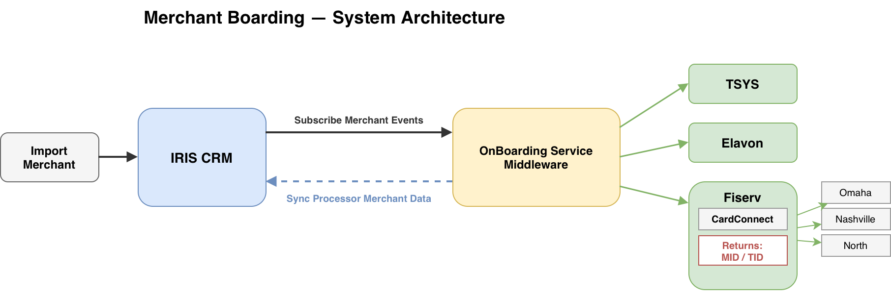

# SUNBAY — Merchant Boarding Automation

## Proposal & Statement of Work

> Version 1.0 | 2026.03 | Confidential

---

## 1. Introduction

This document outlines the scope, deliverables, timeline, and terms for the Merchant Boarding Automation project. SUNBAY will design, develop, and deploy an automated middleware system (OnBoarding Service Middleware) that integrates IRIS CRM (Merchantics instance) with Fiserv CardPointe CoPilot to streamline the merchant onboarding process. The architecture is designed to support future expansion to additional processors (TSYS, Elavon, etc.).

---

## 2. Solution Overview

### 2.1 Current State

Sales personnel manually collect merchant information in IRIS CRM, then re-enter it into CardPointe to submit boarding applications. Approval results are manually copied back to CRM.

| Problem | Impact |
|---|---|
| Manual data entry across two systems | 2-3 days per merchant onboarding |
| Copy-paste between platforms | High error rate, application rejections & rework |
| No automated status tracking | Sales & merchants blind to approval progress |
| Manual process bottleneck | Cannot scale with business growth |

### 2.2 Proposed Solution

An automated middleware that:
1. Auto-collects merchant application data from IRIS CRM and submits to CardPointe Boarding
2. Supports the full MPA signing and underwriting workflow via CoPilot
3. Auto-syncs approval status back to IRIS CRM in real-time
4. Provides full process tracking and audit trail
5. Reduces merchant onboarding cycle from 2-3 days to under 4 hours

### 2.3 System Architecture

> 📎 Draw.io source: [SUNBAY-Merchant-Boarding-Architecture.drawio](./SUNBAY-Merchant-Boarding-Architecture.drawio)

The system connects the following components:

| Component | Role |
|---|---|
| **Import Merchant** | Merchant data intake entry point |
| **IRIS CRM** | Central hub — manages leads, subscribes merchant events to OnBoarding Service |
| **OnBoarding Service Middleware** | Middleware that routes boarding requests to downstream processors; syncs processor merchant data back to IRIS CRM |
| **TSYS** | Processor — TSYS platform *(future expansion)* |
| **Elavon** | Processor — Elavon platform *(future expansion)* |
| **Fiserv** | Processor — CardConnect platform, routes to Omaha / Nashville / North, returns MID / TID |

---

## 3. Scope of Work

### 3.1 Deliverables

| # | Module | Description | Est. Effort |
|---|---|---|---|
| 1 | **IRIS CRM Configuration** | - Create ~30 standardized boarding fields with tab grouping (Basic Info / Bank Info / Business Info / Boarding Status) - Configure lead status workflow rules - Set up webhook subscriptions (`lead.status.updated`, `lead.document.uploaded`) - Enable KYC document upload | 4 days |
| 2 | **OnBoarding Service Middleware — Core** | **Webhook Receiver:** - Receive IRIS CRM merchant event subscriptions - Signature verification & idempotent processing - Event dispatching to corresponding handlers  **Field Mapper:** - Configurable JSON-based mapping rules (IRIS CRM fields → CardPointe boarding fields, extensible to other Processors) - Built-in format converters: dates, currency, addresses, state codes - Mapping rule version management  **Data Validator:** - Required field checks - Format validation: EIN, ABA routing number, zip code - Business rule checks: monthly volume range, MCC validity - Validation failures auto-written back to IRIS CRM as Lead Notes | 10 days |
| 3 | **OnBoarding Service Middleware — Processor Routing** | - Route merchant applications to Fiserv-CardConnect (current phase) - Architecture supports future expansion to TSYS / Elavon - Submit via CardPointe CoPilot Boarding API - Request / response logging & error code mapping - On success, write back `boarding_request_id` to IRIS CRM - Fiserv returns key data: MID / TID | 6 days |
| 4 | **OnBoarding Service Middleware — Sync & Reliability** | **Sync Service:** - Process CardPointe webhook callbacks (approval / decline / updates) - Sync merchant data back to IRIS CRM (lead status, MID/TID, approval date, custom fields, Lead Notes)  **Retry Queue:** - Exponential backoff retry: 1min → 5min → 15min (max 3 attempts) - Dead-letter queue for unresolved failures - Scheduled polling every 15 minutes as webhook fallback - Exception alerts for operations team | 8 days |
| 5 | **Integration Testing & UAT** | - End-to-end testing: IRIS CRM → OnBoarding Service Middleware → Processors - Webhook delivery / retry testing - Exception scenario testing: timeout, decline, duplicates - Performance testing - UAT support | 5 days |
| 6 | **E-Signature Integration** *(optional)* | - Agreement / rate change signing via IRIS CRM E-Signature API - Auto-fill PDF templates, generate signing link, send to merchant - Not part of standard boarding flow | 2 days |
| | | **Total (excluding optional)** | **33 days** |

### 3.2 Out of Scope

CardPointe-side account maintenance operations are not included in this project. Per Fiserv process, these require manual CoPilot tickets or MSC forms:

| Change Type | CardPointe Operation | SLA |
|---|---|---|
| Bank account change | CoPilot ticket (Account Updates → Bank Account Change) | 2 business days |
| Rate / pricing update | MSC form (Rates + Fees) | 48 hours |
| DBA / address / contact change | CoPilot ticket (Account Updates → Demographic Change) | 2 business days |
| MCC / SIC update | CoPilot ticket (Account Updates → MCC/SIC Update) | 2 business days |

Pure ISO agent agreements / commission agreements only involve IRIS CRM record updates and do not require CardPointe sync.

---

## 4. Delivery Timeline

### 4.1 Project Schedule — 8 Weeks

| Phase | Timeline | Deliverables |
|---|---|---|
| **Foundation** | Week 1-3 | IRIS CRM field configuration, database design, webhook receiver, field mapper |
| **Integration** | Week 4-6 | Data validator, boarding service (CardPointe CoPilot API), sync service, retry queue, polling fallback |
| **Launch** | Week 7-8 | End-to-end integration testing, exception scenario testing, UAT, go-live |

### 4.2 Milestones

| Milestone | Target | Criteria |
|---|---|---|
| M1: Pipeline Ready | End of Week 4 | CRM fields configured, webhook events received and mapped successfully |
| M2: Sandbox Flow Complete | End of Week 6 | Full boarding flow working end-to-end in sandbox environment |
| M3: Testing Complete | End of Week 7 | All integration tests passed, exception scenarios verified |
| M4: Production Go-live | End of Week 8 | UAT signed off, production deployment complete |

---

## 5. Client Responsibilities

| # | Item | Owner | Priority |
|---|---|---|---|
| 1 | Confirm CardPointe CoPilot Boarding API availability & obtain sandbox account | Client + Fiserv | 🔴 High — project blocker |
| 2 | Provide CardPointe Boarding API field specs & webhook event documentation | Fiserv | 🔴 High — project blocker |
| 3 | Provide IRIS CRM API token with admin permissions | Client | 🟡 Medium |
| 4 | Confirm IRIS CRM webhook event type naming (Subscriptions API) | Client | 🟡 Medium |
| 5 | Provide SIC Code → MCC mapping table | Client business team | 🟡 Medium |
| 6 | Business rules review & sign-off (1-2 working sessions) | Client + SUNBAY | 🟡 Medium |
| 7 | E-Signature templates for agreements/rate changes *(if optional scope included)* | Client legal/business | 🟢 Low |

---

## 6. Assumptions & Risks

### 6.1 Assumptions

- CardPointe CoPilot provides a REST API for programmatic merchant boarding submissions. If not available, an alternative approach will need to be evaluated and may impact timeline and cost.
- IRIS CRM API rate limit (120 requests/minute) is sufficient for expected boarding volume.
- Client will provide timely access to all required API credentials and documentation.
- Sandbox/test environments are available for both IRIS CRM and CardPointe.

### 6.2 Risks

| Risk | Impact | Mitigation |
|---|---|---|
| CoPilot Boarding API not available for programmatic access | High — core dependency | Confirm with Fiserv before project start; evaluate alternatives if needed |
| CardPointe API field specs change between sandbox and production | Medium | Configurable field mapping with version management |
| IRIS CRM custom field count limit | Low-Medium | Confirm limit with IRIS CRM support before configuration |
| Webhook delivery failures | Low | Retry mechanism + scheduled polling fallback |

---

## 7. Pricing

| Item | Cost |
|---|---|
| Merchant Boarding Automation (Deliverables #1-5) | $[TBD] |
| E-Signature Integration — optional (Deliverable #6) | $[TBD] |
| **Total** | **$[TBD]** |

*Payment terms: [TBD — e.g., 30% upfront, 40% at M2, 30% at go-live]*

---

## 8. Acceptance Criteria

- All deliverables listed in Section 3.1 (excluding optional items not selected) are completed and demonstrated.
- End-to-end merchant boarding flow tested successfully in production environment.
- Client UAT sign-off received.
- Documentation delivered: API integration guide, field mapping reference, operations runbook.

---

## 9. Terms & Conditions

- **Change Management**: Any scope changes after sign-off will be evaluated for timeline and cost impact and require written approval from both parties.
- **Intellectual Property**: All custom middleware code developed under this SOW is owned by [TBD — Client / SUNBAY / joint].
- **Confidentiality**: Both parties agree to keep project details, API credentials, and merchant data confidential.
- **Warranty**: SUNBAY provides [TBD] days of bug-fix support after go-live at no additional cost.

*For full legal terms, refer to the Master Service Agreement (MSA) between SUNBAY and Client.*

---

## 10. Signatures

| | Client | SUNBAY Technology |
|---|---|---|
| Name | _________________________ | _________________________ |
| Title | _________________________ | _________________________ |
| Date | _________________________ | _________________________ |
| Signature | _________________________ | _________________________ |

---

> SUNBAY Technology | Merchant Boarding Automation — Proposal & SOW v1.0
