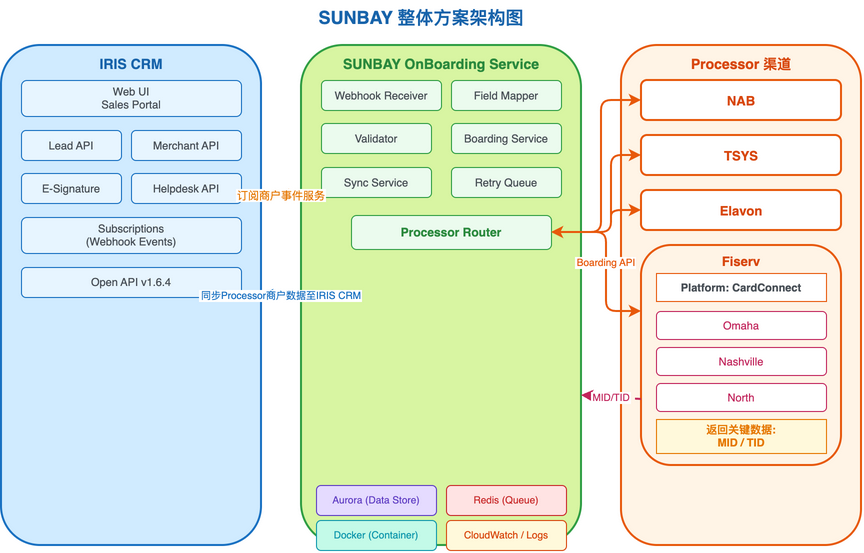
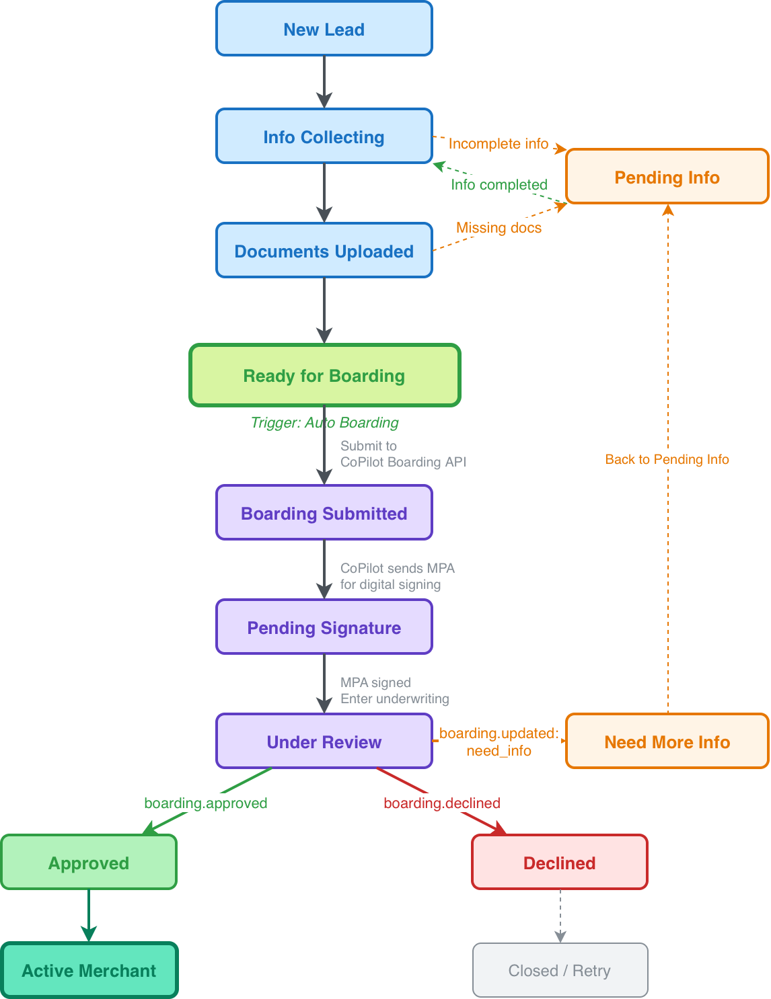

# 《SUNBAY 商户入驻系统（Merchant Boarding）集成开发方案》

---

## 1. 背景及现状

### 项目背景

本方案为 SUNBAY 代客户（ISO/代理商）开发的商户 Boarding 集成方案。

客户当前使用 IRIS CRM（Merchantics 实例）管理销售线索和商户关系，使用 Fiserv CardPointe 作为支付网关处理交易。目前商户入驻流程依赖人工操作：销售人员在 IRIS CRM 中收集商户信息后，需手动登录 CardPointe 后台提交入驻申请，审批结果再手动回填到 CRM 系统。该流程存在以下痛点：

- **效率低下**：人工在两个系统间搬运数据，单个商户入驻耗时 2-3 天
- **易出错**：手动录入导致字段遗漏、格式错误，退回率高
- **状态不透明**：审批进度无法实时追踪，销售和商户体验差
- **无法规模化**：随着业务增长，人工处理成为瓶颈

### 需求依据

- IRIS CRM Open API v1.6.4 文档：https://merchantics.iriscrm.com/api [附录 #1]
- Fiserv CardPointe Gateway API 文档：https://developer.fiserv.com/product/CardPointe/apis?branch=active [附录 #4]
- Fiserv CardPointe CoPilot 商户入驻文档（Boarding API 待确认）[附录 #6]

### 改造/建设目标

由 SUNBAY 为客户构建 IRIS CRM 与 CardPointe 之间的自动化商户入驻中间件系统，实现：
1. 从 IRIS CRM 自动采集商户申请数据并提交至 CardPointe Boarding
2. 入驻审批状态自动同步回 IRIS CRM
3. 全流程可追踪、可审计
4. 商户入驻周期从 2-3 天缩短至 4 小时内

### 产品/系统范围

| 维度 | 内容 |
|------|------|
| 核心产品/系统 | IRIS CRM（Merchantics）、SUNBAY OnBoarding Service（新建）、Processors（TSYS / Elavon / Fiserv-CardConnect） |
| 终端/客户端类型 | Web 端（IRIS CRM 界面）、API（中间件服务） |
| 业务渠道/方式 | ISO/代理商线上商户入驻、销售团队 CRM 操作 |

---

## 2. 业务需求

### 2.1 商户信息采集（IRIS CRM 侧）

- 在 IRIS CRM 中配置标准化的商户入驻自定义字段（Lead Fields），覆盖 CardPointe Boarding 所需全部信息
- 支持 KYC 文档上传（营业执照、身份证明、银行对账单、void check）
- Lead 状态机管理，支持从 "New Lead" 到 "Active Merchant" 的完整生命周期

### 2.2 自动化入驻流程（中间件）

- 监听 IRIS CRM Webhook（`lead.status.updated`），当 Lead 状态变为 "Ready for Boarding" 时自动触发
  > ⚠️ 待确认：Webhook 事件类型的精确命名需在 IRIS CRM Subscriptions API 文档中核实 [附录 #1, #2]
- 从 IRIS CRM 拉取完整商户数据并进行字段映射转换
- 提交前进行本地数据校验（必填项、格式、业务规则）
- 调用 CardPointe CoPilot Boarding API 创建商户申请
  > ⚠️ 待确认：CardPointe 商户入驻通过 CoPilot 平台完成，需与 Fiserv 确认是否提供 REST API 供程序化调用 [附录 #6]
- 支持失败重试（指数退避，最多 3 次）
- 超过重试次数后标记为异常，通知运营人员人工介入

### 2.3 CoPilot MPA 签名与核保流程

中间件提交商户申请至 CoPilot 后，由 CoPilot 平台接管签名与核保流程：

1. **MPA 生成**：CoPilot 基于 Application Template 和提交的商户数据，生成动态 MPA（Merchant Processing Application）[附录 #6]
2. **发送签名**：CoPilot 通过邮件向商户（Account Owner）发送数字签名链接，商户需注册 CardPointe 账户后通过浏览器完成 MPA 审阅与电子签名 [附录 #6]
   - ISO 可在发送前通过 CoPilot 预填部分字段（如银行信息），银行信息通过 GIACT + Plaid 在线验证，验证通过则无需提供 voided check [附录 #6]
   - 也支持下载 PDF 纸质签名后上传至 CoPilot 作为替代 [附录 #6]
3. **核保审批**：签名完成后自动进入核保（Underwriting）流程 [附录 #6]
   - 自动审批：符合条件的申请通常数分钟内完成
   - 人工审批：不符合自动审批条件的申请转人工审核，通常 24 小时内完成
4. **结果通知**：审批完成后 CoPilot 通过 Webhook 回调通知中间件

> 注：MPA 模板、签名邮件均支持 ISO 品牌定制（CoPilot/CardPointe/对账单/MPA 可定制，邮件暂不支持定制，使用 CardPointe 品牌发送）。[附录 #6]

### 2.4 状态同步与通知（双向）

- 接收 CardPointe Webhook 回调（审批通过/拒绝/更新）
  > ⚠️ 待确认：CoPilot Webhook 回调的事件类型及 payload 格式需从 Fiserv 获取实际规格文档
- 将审批结果同步回 IRIS CRM：
  - 更新 Lead 自定义字段（MID、审批状态、开通日期）
  - 添加 Lead Note（审批备注、拒绝原因）
  - 自动流转 Lead 状态
- 定时轮询兜底机制（每 15 分钟检查 pending 状态申请）
- 审批通过/拒绝时通过 IRIS CRM 发送邮件/短信通知商户

### 2.5 运营管理与审计

> 以下为业务层面的运营需求，具体技术实现随中间件各模块内置。

- 全链路操作日志（请求/响应/状态变更）
- 异常告警：API 调用失败、Webhook 投递失败、状态不一致
- 敏感数据脱敏存储（银行账号、税号等 PII 信息）

### 2.6 附加流程：协议/费率变更签名（IRIS CRM E-Signature，可选）

> 本流程不属于标准 Boarding 流程，仅在客户有额外的代理协议、费率变更协议等需要商户签署时启用。

- 通过 IRIS CRM E-Signature API 创建签名模板，配置 Lead 字段到 PDF 的映射 [附录 #2]
- 在特定业务节点（如费率调整、协议续签）触发签名流程
- 自动用 Lead 数据填充 PDF 模板，生成签名链接并发送给商户
- 签署完成后更新 Lead 状态/备注
- **CardPointe 侧变更为半自动流程**：CoPilot 未提供 ticket/maintenance REST API，涉及 CardPointe 侧的变更（费率更新、银行账户变更、DBA/地址变更等）需运营人员手动在 CoPilot Web 界面提交 ticket 或通过 MSC 提交表单完成 [附录 #7]

| 变更类型 | CardPointe 操作方式 | SLA |
|---|---|---|
| 银行账户变更 | CoPilot ticket（Account Updates → Bank Account Change） | 2 个工作日 |
| 费率/定价更新 | MSC 表单（Rates + Fees） | 48 小时 |
| DBA/地址/联系方式变更 | CoPilot ticket（Account Updates → Demographic Change） | 2 个工作日 |
| MCC/SIC 更新 | CoPilot ticket（Account Updates → MCC/SIC Update） | 2 个工作日 |

> 注：纯 ISO 代理协议/佣金协议仅涉及 IRIS CRM 记录更新，不需要同步到 CardPointe。

---

## 3. 技术方案

### 3.1 整体方案架构图

> 📎 Draw.io 源文件：[SUNBAY-整体方案架构图.drawio](./SUNBAY-整体方案架构图.drawio)



**关键数据流：**

```
① Lead 创建/更新 → IRIS CRM 订阅商户事件 → SUNBAY OnBoarding Service
② SUNBAY OnBoarding Service → Field Mapper → Validator → Boarding Service
③ Boarding Service → Processor（TSYS / Elavon / Fiserv-CardConnect）
④ Fiserv 返回关键数据 MID / TID
⑤ SUNBAY OnBoarding Service → 同步 Processor 商户数据至 IRIS CRM（回写状态/MID/TID）
```

### 3.2 开发项明细

| Items（开发项） | Sub Items（子项/涉及系统） | Desc（具体内容） | UI/UX 设计需求 | 研发工作量（人天） |
|----------------|--------------------------|----------------|---------------|-----------------|
| 1. IRIS CRM 配置 | Lead 自定义字段 | - 创建 Boarding 所需全部自定义字段（约 30 个）<br>- 配置字段分组（Tab）：基本信息/银行信息/业务信息/入驻状态<br>- 配置 Lead 状态流转规则 | 无 | 3 |
| | Webhook 订阅 | - 配置 `lead.status.updated` 订阅<br>- 配置 `lead.document.uploaded` 订阅<br>⚠️ 事件类型精确命名待核实 IRIS CRM Subscriptions API 文档 | 无 | 1 |
| | E-Signature 模板（可选） | - 创建协议/费率变更签名模板<br>- 配置 Application Field Mapping<br>- 不属于标准 Boarding 流程 | 有，1页 | 2 |
| 2. Webhook Receiver | 中间件服务 | - 接收 IRIS CRM Webhook（lead.status.updated 等）<br>- 接收 CardPointe Webhook（审批通过/拒绝/更新，事件名称待确认）<br>- 签名验证/幂等处理<br>- 事件分发到对应 Handler | 无 | 5 |
| 3. Field Mapper | 中间件服务 | - IRIS CRM Lead 字段 → CardPointe Boarding 字段映射<br>- 可配置化映射规则（JSON 配置文件）<br>- 支持字段格式转换（日期/金额/地址等）<br>- 映射规则版本管理 | 无 | 4 |
| 4. Data Validator | 中间件服务 | - 必填项校验<br>- 格式校验（EIN/SSN、银行路由号、邮编等）<br>- 业务规则校验（月交易量范围、MCC 有效性等）<br>- 校验失败自动回写 IRIS CRM Lead Note | 无 | 3 |
| 5. Boarding Service | 中间件服务 | - 调用 CardPointe CoPilot Boarding API 提交商户申请<br>- 请求/响应日志记录<br>- 异常处理与错误码映射<br>- 提交成功后回写 boarding_request_id 到 IRIS CRM | 无 | 5 |
| 6. Sync Service | 中间件服务 | - 处理 CardPointe 审批回调<br>- 更新 IRIS CRM Lead 状态/自定义字段<br>- 添加 Lead Note（审批结果/MID/拒绝原因）<br>- 触发邮件/短信通知（调用 IRIS CRM 模板） | 无 | 4 |
| 7. Retry Queue | 中间件服务 | - Redis 基础的异步任务队列<br>- 指数退避重试策略（1min/5min/15min）<br>- 死信队列（超过重试次数）<br>- 异常告警通知 | 无 | 3 |
| 8. 定时轮询兜底 | 中间件服务 | - 每 15 分钟查询 pending 状态的 boarding 请求<br>- 主动查询 CardPointe 申请状态<br>- 与 Webhook 结果做一致性校验 | 无 | 2 |
| 9. 数据库设计 | Aurora | - boarding_requests 表（核心映射表）<br>- webhook_events 表（事件日志）<br>- field_mappings 表（映射配置）<br>- audit_logs 表（审计日志）<br>- 数据迁移脚本 | 无 | 2 |
| 10. 集成测试 | 全系统 | - IRIS CRM → Middleware → CardPointe 全链路测试<br>- Webhook 投递/重试测试<br>- 异常场景测试（超时/拒绝/重复）<br>- 性能测试（并发入驻） | 无 | 5 |
| | | **Total** | **1页** | **39 人天** |

#### 开发项技术实现方案与风险点

**1. IRIS CRM 配置**
- 技术实现：通过 IRIS CRM Lead Fields API（POST /leads/fields）批量创建自定义字段；通过 Subscriptions API（POST /subscriptions）配置 Webhook
- 风险点：IRIS CRM 自定义字段数量上限需确认；Webhook URL 需公网可访问

**2. Webhook Receiver**
- 技术实现：Node.js/Express 或 Python/FastAPI 实现 HTTP 端点；使用 HMAC-SHA256 验证 Webhook 签名；Redis 存储已处理事件 ID 实现幂等
- 风险点：IRIS CRM Webhook 签名验证机制需确认文档；公网暴露端点需做安全加固

**3. Field Mapper**
- 技术实现：JSON Schema 定义映射规则，支持热加载；内置常用转换器（日期格式、金额单位、地址拆分合并）
- 风险点：CardPointe Boarding API 字段规格可能随版本变化；部分字段可能需要人工补充（如 MCC 选择）

**4. Data Validator**
- 技术实现：基于 JSON Schema + 自定义校验规则引擎；EIN 格式校验（XX-XXXXXXX）、ABA 路由号校验（9 位 + checksum）
- 风险点：不同处理器对字段要求可能不同

**5. Boarding Service**
- 技术实现：封装 CardPointe CoPilot Boarding API Client；请求签名/认证处理；响应码映射为业务状态
- 风险点：⚠️ CardPointe 商户入驻通过 CoPilot 平台完成，**需与 Fiserv 确认是否提供可程序化调用的 REST API** [附录 #6]，若不支持则需评估替代方案（如 CoPilot Web 自动化）；沙箱环境可用性待确认；API 限流策略需确认

**6. Sync Service**
- 技术实现：解析 CardPointe 回调 payload，提取 MID/状态/原因；调用 IRIS CRM API 批量更新（PATCH /leads/{leadId} + POST /leads/{leadId}/notes）
- 风险点：IRIS CRM API 限流 120 次/分钟，批量同步时需控制速率

**7. Retry Queue**
- 技术实现：Redis + Bull Queue（Node.js）或 Celery（Python）；配置指数退避：attempt 1 → 1min, attempt 2 → 5min, attempt 3 → 15min
- 风险点：Redis 持久化配置需确保任务不丢失

---

### 3.3 数据字段映射表

> ⚠️ 以下 CardPointe Boarding 字段名为预估，实际字段规格需待 CoPilot Boarding API 文档确认后更新（前置依赖 #2）。

| IRIS CRM Lead 字段 | CardPointe Boarding 字段 | 类型 | 必填 | 转换规则 |
|---|---|---|---|---|
| company_name | legal_name | String | ✅ | 直接映射 |
| dba_name | dba | String | ✅ | 直接映射 |
| contact_first_name | owner_first_name | String | ✅ | 直接映射 |
| contact_last_name | owner_last_name | String | ✅ | 直接映射 |
| email | email | String | ✅ | 格式校验 |
| phone | phone | String | ✅ | 去除格式符号，保留纯数字 |
| address_line1 | business_address1 | String | ✅ | 直接映射 |
| address_line2 | business_address2 | String | | 直接映射 |
| city | business_city | String | ✅ | 直接映射 |
| state | business_state | String | ✅ | 转为 2 位州代码 |
| zip_code | business_zip | String | ✅ | 5 位或 9 位格式 |
| ein_ssn | tax_id | String | ✅ | 去除连字符 |
| bank_name | bank_name | String | ✅ | 直接映射 |
| bank_routing | routing_number | String | ✅ | 9 位 ABA 校验 |
| bank_account | account_number | String | ✅ | 加密传输 |
| sic_code | mcc | String | ✅ | SIC → MCC 映射表 |
| business_type | ownership_type | String | ✅ | 枚举映射 |
| monthly_volume | avg_monthly_volume | Decimal | ✅ | 单位：美元 |
| avg_ticket | avg_ticket_amount | Decimal | ✅ | 单位：美元 |
| max_ticket | max_ticket_amount | Decimal | | 单位：美元 |
| website_url | website | String | | URL 格式校验 |
| business_start_date | date_established | Date | ✅ | 转为 YYYY-MM-DD |
| — | boarding_request_id | String | — | 提交后回写 |
| — | merchant_id (MID) | String | — | 审批通过后回写 |
| — | boarding_status | String | — | 状态同步回写 |
| — | boarding_date | Date | — | 审批通过日期回写 |

### 3.4 Lead 状态机设计

> 📎 Draw.io 源文件：[SUNBAY-Lead状态机设计.drawio](./SUNBAY-Lead状态机设计.drawio)



---

## 4. 项目启动条件

### 4.1 确定项目 UI/UX 交互设计

- 目标版本号：SUNBAY Merchant Boarding v1.0.0
- UI/UX 设计稿确认状态：
  - IRIS CRM Lead 字段布局（Tab 分组）：需确认
  - 协议/费率变更签名模板（可选）：需确认

### 4.2 项目研发工作量评估

- 总工作量：39 人天
- 团队配置：

| 角色 | 人数 | 职责 |
|------|------|------|
| 后端工程师 | 2 | 中间件核心开发（Webhook/Mapper/Boarding/Sync） |
| DevOps 工程师 | 1（兼职） | 部署、CI/CD、监控配置 |
| QA 工程师 | 1 | 集成测试、异常场景测试 |
| 产品/业务 | 1（兼职） | IRIS CRM 字段配置、业务规则确认、UAT |

### 4.3 项目实施计划

| Items | Description | W1 | W2 | W3 | W4 | W5 | W6 | W7 | W8 |
|-------|-------------|----|----|----|----|----|----|----|----|
| IRIS CRM 配置 | 自定义字段/Webhook/E-Signature | ■ | ■ | | | | | | |
| 数据库设计 | 表结构/迁移脚本 | ■ | | | | | | | |
| Webhook Receiver | 接收/验签/幂等/分发 | | ■ | ■ | | | | | |
| Field Mapper | 字段映射/转换/配置化 | | ■ | ■ | | | | | |
| Data Validator | 校验规则引擎 | | | ■ | ■ | | | | |
| Boarding Service | CardPointe API 对接 | | | | ■ | ■ | | | |
| Sync Service | 状态回写/通知 | | | | | ■ | ■ | | |
| Retry Queue | 重试/死信/告警 | | | | | ■ | | | |
| 定时轮询兜底 | 状态一致性校验 | | | | | | ■ | | |
| 集成测试 | 全链路/异常/性能 | | | | | | | ■ | ■ |
| UAT & 上线 | 用户验收/灰度发布 | | | | | | | | ■ |

**关键路径**：IRIS CRM 配置 → Webhook Receiver → Field Mapper → Boarding Service → Sync Service → 集成测试

### 4.3.1 版本发布计划

| 时间节点 | 版本号 | 发布内容 |
|----------|--------|---------|
| W4 结束 | v0.1.0-alpha | IRIS CRM 字段配置完成 + Webhook Receiver + Field Mapper（可接收事件并完成字段映射） |
| W6 结束 | v0.5.0-beta | Boarding Service + Sync Service + Retry Queue（完整入驻流程可跑通，沙箱环境） |
| W7 结束 | v0.9.0-rc | 集成测试通过，全链路验证完成 |
| W8 结束 | v1.0.0 | UAT 通过，生产环境上线 |

---

## 5. 前置依赖与待确认事项

| # | 事项 | 负责方 | 状态 |
|---|------|--------|------|
| 1 | CardPointe CoPilot Boarding API 可用性确认及沙箱环境账号申请 | 客户 + Fiserv | ⚠️ 高优先级待确认 |
| 2 | CardPointe Boarding API 详细字段规格及 Webhook 事件规格文档 | Fiserv | ⚠️ 高优先级待获取 |
| 3 | IRIS CRM API Token 权限范围确认 | 客户 | 待确认 |
| 4 | IRIS CRM Subscriptions API Webhook 事件类型精确命名确认 | 客户 | 待确认 |
| 5 | IRIS CRM 自定义字段数量上限 | 客户 | 待确认 |
| 6 | Webhook 接收端公网域名/IP + SSL 证书 | SUNBAY DevOps | 待配置 |
| 7 | 商户协议/费率变更签名模板（E-Signature 用，可选）| 客户业务/法务 | 待提供 |
| 8 | SIC Code → MCC 映射表 | 客户业务 | 待提供 |
| 9 | 生产环境服务器/云资源 | SUNBAY DevOps | 待采购 |

---

> 文档版本：v1.2 | 编制日期：2026-03-16 | 编制人：SUNBAY 技术团队 | 更新说明：基于 API 真实性验证修正 CardPointe Boarding API 及 Webhook 事件命名；补充 CoPilot MPA 签名流程；补充引用依据

---

## 附录：引用依据

| # | 引用内容 | 链接 |
|---|---------|------|
| 1 | IRIS CRM Open API 文档（Merchantics 实例） | https://merchantics.iriscrm.com/api |
| 2 | IRIS CRM Open API 概述（Leads/Merchants/E-Signature/Subscriptions） | https://merchantics.iriscrm.com/api#section/Open-API |
| 3 | IRIS CRM PHP SDK（API 功能参考） | https://packagist.org/packages/iris-crm/php-sdk |
| 4 | CardPointe Gateway API 文档 | https://developer.fiserv.com/product/CardPointe/apis?branch=active |
| 5 | CardPointe Gateway API 介绍 | https://support.cardpointe.com/cardpointe-gateway-api/ |
| 6 | CoPilot & CardPointe 平台概述（Boarding/MPA 签名/核保/品牌定制） | https://support.cardpointe.com/additional-pages/transitioning-to-copilot---cardpointe/ |
| 7 | CoPilot Ticketing 101（账户维护/费率变更/银行变更操作方式及 SLA） | https://support.cardpointe.com/additional-pages/copilot-ticketing-101/ |
